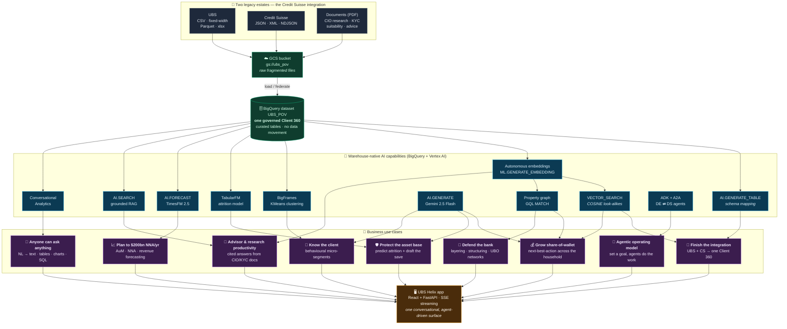
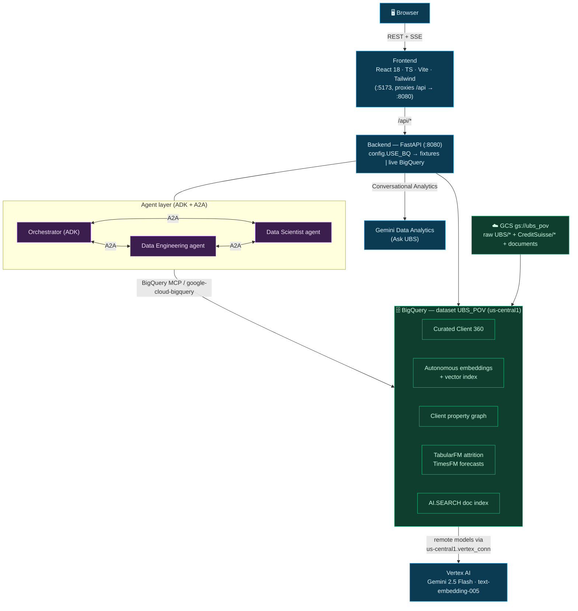

# UBS Helix

**An agentic wealth-&-banking intelligence demo on the Google Cloud Agentic Data Platform.**

UBS Helix takes the reality of the **UBS + Credit Suisse integration** — two banks, two
of everything, fragmented formats, overlapping clients — and turns it into a unified,
conversational, agent-driven decision surface. Every screen is powered by a native
**BigQuery AI** capability: autonomous embeddings, vector search, a client property
graph, TimesFM forecasting, a TabularFM attrition model, Conversational Analytics, and
grounded document RAG — all running *inside* the warehouse, with a **Data Engineering**
agent and a **Data Scientist** agent collaborating over **A2A**.

It runs in two modes:

| Mode | Flags | What happens | Needs GCP? |
|---|---|---|---|
| **Demo** | `USE_BQ=false` / `VITE_USE_MOCKS=true` | Realistic fixtures, zero cloud calls | ❌ No |
| **Live** | `USE_BQ=true` / `VITE_USE_MOCKS=false` | Real BigQuery AI / Vertex AI / graph / forecasting | ✅ Yes |

> Full design rationale, UBS research and the use-case mapping live in
> [`UBS_AGENTIC_POV_PLAN.md`](UBS_AGENTIC_POV_PLAN.md). The CxO walk-through is in
> [`SPEAKER_PITCH.md`](SPEAKER_PITCH.md).

---

## What it demonstrates

| Page | Business question | BigQuery AI capability |
|---|---|---|
| **Home** | What does the unified estate look like? | Federated KPIs across the two-bank estate |
| **Unify & Resolve** | Can we collapse UBS + CS into one truth? | `AI.GENERATE_TABLE` mapping + autonomous embeddings + `VECTOR_SEARCH` entity resolution |
| **Next-Best-Action** | What should this household hold next? | **Property graph** (GQL `MATCH`) + `VECTOR_SEARCH` look-alikes |
| **Flight-Risk Sentinel** | Which clients will we lose, and what do we offer? | **TabularFM** attrition (boosted-tree default) + `AI.GENERATE` plays |
| **Forecast Room** | Where are AuM / NNA / revenue heading? | `AI.FORECAST` (**TimesFM 2.5**) — zero-training, multi-series |
| **Ask UBS** | Let anyone query the estate in English | **Conversational Analytics** (NL → text + table + chart + SQL) |
| **Research Brain** | Answer from CIO / KYC / suitability docs | Autonomous embeddings + `AI.SEARCH` grounded RAG |
| **Network Guard** | Where is the financial-crime risk? | **Property graph** multi-hop GQL (layering / structuring / UBO) |
| **Segment Studio** | What natural client groups exist? | **BigFrames** KMeans + `AI.GENERATE` naming |
| **Agent Console** | One goal → the right specialists run it | **ADK** orchestrator + **A2A** (DE ⇄ DS agents) + BigQuery MCP |

---

## Use-case & capability flow

This maps the end-to-end story: two fragmented legacy estates (UBS + Credit Suisse) flow
into one BigQuery dataset, a set of **warehouse-native AI capabilities** turn that data into
intelligence, and each capability powers a concrete **business use case** — all consumed through
one conversational, agent-driven surface. Every box in the green layer is a BigQuery / Vertex AI
primitive; there is **no separate vector DB, graph DB, feature store, or model-serving stack.**



> **Read it top-down:** two banks' raw files → one warehouse → native AI primitives → business
> outcomes → a single surface. The same `UBS_POV` dataset feeds every capability, and
> Conversational Analytics + ADK/A2A agents sit on top so users set *intent* while the platform
> does the heavy lifting.

---

## Architecture



Everything AI/ML happens **in BigQuery** via one Cloud-resource connection to Vertex AI.
No separate vector DB, graph DB, feature store, or model-serving stack.

---

## Prerequisites

| Tool | Version |
|---|---|
| Python | 3.11+ (3.9 works for generation; backend targets 3.11) |
| Node.js | 20+ |
| Google Cloud SDK | latest (`gcloud`, `bq`) |

For **live mode**: a GCP project with billing, BigQuery + Vertex AI + Storage +
Gemini Data Analytics APIs enabled, and `gcloud auth application-default login`.

---

## Quick start — Demo mode (no GCP)

```bash
# 1) Backend (fixtures)
cd backend
python3 -m venv .venv && source .venv/bin/activate
pip install -r requirements.txt
uvicorn app.main:app --reload --port 8080        # http://localhost:8080/healthz

# 2) Frontend (mocks) — new terminal
cd ../frontend
npm install
npm run dev                                       # http://localhost:5173
```

`USE_BQ` defaults to `false` and `VITE_USE_MOCKS` defaults to `true`, so every screen
renders from realistic local data. Done.

---

## Full setup — Live mode (this deployment: `raves-altostrat` / `us-central1`)

```bash
export PROJECT=raves-altostrat REGION=us-central1
export DATASET=UBS_POV BUCKET=ubs_pov CONNECTION=vertex_conn
```

### 1 — Enable APIs & create resources
```bash
gcloud services enable bigquery.googleapis.com bigqueryconnection.googleapis.com \
  aiplatform.googleapis.com storage.googleapis.com geminidataanalytics.googleapis.com \
  --project=$PROJECT
bq --location=$REGION mk --dataset $PROJECT:$DATASET
gcloud storage buckets create gs://$BUCKET --location=$REGION --project=$PROJECT
bq mk --connection --location=$REGION --project_id=$PROJECT \
   --connection_type=CLOUD_RESOURCE $CONNECTION       # or reuse the existing one
# grant the connection SA roles/aiplatform.user (see plan §0/§3)
```

### 2 — Generate & load the synthetic two-bank estate
```bash
cd synthetic_data
python3 -m venv .venv && source .venv/bin/activate
pip install -r requirements.txt
export GOOGLE_CLOUD_PROJECT=$PROJECT GCP_REGION=$REGION BQ_LOCATION=$REGION
export BQ_DATASET=$DATASET GCS_BUCKET=$BUCKET
python make_all.py --gcp        # generate → upload to GCS → load BigQuery
# (python make_all.py --local first if you just want files in ./output)
```

### 3 — Build the AI / graph / model layer
```bash
cd ..
bq --project_id=$PROJECT --location=$REGION query --use_legacy_sql=false < infra/setup_bq.sql
bq --project_id=$PROJECT --location=$REGION query --use_legacy_sql=false < infra/setup_ubs_attrition.sql
bq --project_id=$PROJECT --location=$REGION query --use_legacy_sql=false < infra/setup_ubs_forecast.sql
```

### 4 — Run the backend (live)
```bash
cd backend && source .venv/bin/activate
pip install -r requirements-bq.txt
cp ../infra/env.example .env     # set USE_BQ=true
uvicorn app.main:app --port 8080
curl http://localhost:8080/healthz       # {"status":"ok","use_bq":true,...}
```

### 5 — Run the frontend (live)
```bash
cd ../frontend
echo "VITE_USE_MOCKS=false" > .env.local
npm run dev                              # proxies /api → :8080
```

---

## Deploy to Cloud Run

```bash
export GOOGLE_CLOUD_PROJECT=$PROJECT GCP_REGION=$REGION
./infra/deploy_cloudrun.sh
```
Builds `ubs-helix-api` and `ubs-helix-web` and deploys both. Ensure the Cloud Run runtime
service account has **BigQuery Job User**, **BigQuery Data Viewer**, **Vertex AI User**,
and access to `us-central1.vertex_conn`.

---

## Project layout

```
UBS/
├── UBS_AGENTIC_POV_PLAN.md     design blueprint + UBS research
├── SPEAKER_PITCH.md            CxO demo narrative
├── README.md                   this file
├── infra/
│   ├── setup_bq.sql            models · embeddings · vector index · property graph · KPIs
│   ├── setup_ubs_attrition.sql attrition model + scoring + drivers + pipeline
│   ├── setup_ubs_forecast.sql  AI.FORECAST (TimesFM) marts
│   ├── deploy_cloudrun.sh
│   └── env.example
├── synthetic_data/             two-bank estate generator + GCS/BQ loaders
├── backend/                    FastAPI (routers, bq.py, services, ADK/A2A agents, fixtures)
└── frontend/                   React 18 + TS + Vite + Tailwind (10 routes)
```

---

## Notes & caveats

- **All data is synthetic.** No real UBS or Credit Suisse data is used.
- **Preview features:** TabularFM ships as a documented headline with a GA boosted-tree
  default in `setup_ubs_attrition.sql`; A2A is implemented in-process (swappable for the
  `a2a` SDK). Autonomous embeddings use the GA `ML.GENERATE_EMBEDDING` path.
- **Cost control:** keep `DATA_SCALE=1`; forecast/score outputs are cached in tables; the
  backend falls back to fixtures on any live error so the demo never breaks.
